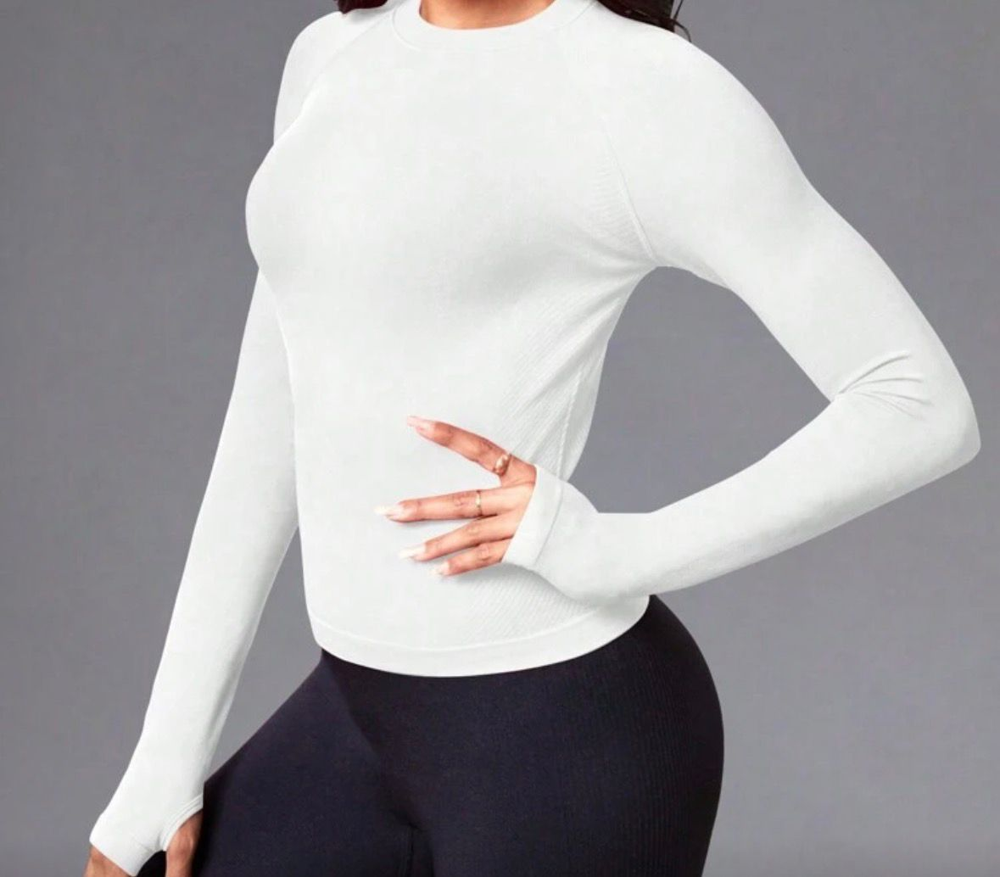

# 📚 GUÍA COMPLETA - TOPSTORE CATÁLOGO

## ⚠️ IMPORTANTE - LEER PRIMERO

Este proyecto está **FUNCIONANDO**. Si sigues estas reglas, no lo dañarás.

---

## 📁 ESTRUCTURA DEL PROYECTO

```
C:\Users\JOHANPRO\Desktop\Top Stores\Catalogo\
├── index.html              ← Selector HOMBRES/MUJERES (PÁGINA PRINCIPAL)
├── css/
│   └── styles.css         ← Estilos CSS Premium
├── js/
│   └── script.js          ← JavaScript (modal, toggle, navegación)
├── HOMBRES/
│   ├── camisas-hombre.html
│   ├── buzos-hombre.html
│   ├── chaquetas-hombre.html
│   ├── Camisas-Hombre/
│   │   ├── Camisa I DONT CARE/
│   │   ├── Camisa Tirantes/
│   │   ├── WORKOUT/
│   │   ├── Camisa-OWN-IT/
│   │   ├── Camisa-ALPHA/
│   │   └── Sin-manga-doble-lineas/
│   ├── Camisas-Compresoras-Sencillas/
│   ├── Buzos/
│   │   ├── Buzo-Hombre-Sin-Manga/
│   │   └── Buzo-compresor/
│   └── Chaquetas/
│       └── Chaqueta-Deportiva-Larga/
└── MUJERES/
    ├── buzos.html
    ├── camisas-mujer.html
    ├── chaquetas.html
    ├── conjuntos.html
    ├── enterizos.html
    ├── leggings.html
    ├── medias.html
    ├── shorts.html
    ├── tops.html
    ├── Buzos/
    ├── Camisas-Mujer/
    │   ├── Camisa compresora/
    │   └── Camisa deportiva/
    ├── Chaquetas/
    ├── Conjuntos/
    │   ├── Conjunto con Short/
    │   └── Conjunto con Top/
    ├── Enterizos/
    │   ├── Enterizo Completo/
    │   └── Enterizo Corto/
    ├── Leggings/
    ├── Medias/
    ├── Short/
    │   ├── Short con Malla/
    │   └── Short con Push Up/
    ├── Short-con-Push-Up-corte-en-V/
    └── Tops/
```

---

## 👕👖 PRODUCTOS POR CATEGORÍA

### HOMBRES
| Categoría | Subcategorías | Página HTML |
|----------|--------------|-------------|
| **Camisas** | I DONT CARE, WORKOUT, Tirantes, OWN IT, ALPHA, Sin manga doble lineas, Compresoras Sencillas | camisas-hombre.html |
| **Buzos** | Hombre Sin Manga, Compresor | buzos-hombre.html |
| **Chaquetas** | Deportiva Larga | chaquetas-hombre.html |

### MUJERES
| Categoría | Subcategorías | Página HTML |
|----------|--------------|-------------|
| **Camisas** | Compresora, Deportiva | camisas-mujer.html |
| **Buzos** | Genérico | buzos.html |
| **Chaquetas** | Genérico | chaquetas.html |
| **Conjuntos** | con Short, con Top | conjuntos.html |
| **Enterizos** | Completo, Corto | enterizos.html |
| **Leggings** | Genérico | leggings.html |
| **Shorts** | con Malla, con Push Up, Push Up corte en V | shorts.html |
| **Tops** | Genérico | tops.html |
| **Medias** | Genérico | medias.html |

---

## 🔗 REGLAS DE RUTAS

### index.html (raíz)
```html
<link rel="stylesheet" href="css/styles.css">

<!-- Imágenes HOMBRES -->


<!-- Imágenes MUJERES -->

```

### HOMBRES/*.html
```html
<link rel="stylesheet" href="../css/styles.css">

<!-- Imágenes (dentro de HOMBRES/, sin ../) -->

```

### MUJERES/*.html
```html
<link rel="stylesheet" href="../css/styles.css">

<!-- Imágenes (dentro de MUJERES/, sin ../) -->

```

---

## 🎨 ESTRUCTURA HTML

### index.html - Selector de Género
```html
<section class="gender-selector">
    <h1>¿Para quién es?</h1>
    <div class="gender-buttons">
        <button id="btn-hombres" onclick="switchCategory('hombres')">
            👨 HOMBRES
        </button>
        <button id="btn-mujeres" onclick="switchCategory('mujeres')">
            👩 MUJERES
        </button>
    </div>
</section>

<section id="hombres" class="category-section active">
    <h3 class="subsection-title">Camisas</h3>
    <div class="preview-grid">
        <div class="preview-card">
            
            <h3>Nombre</h3>
            <a href="HOMBRES/camisas-hombre.html">Ver colección →</a>
        </div>
    </div>
</section>
```

### Página de Categoría (HOMBRES/ o MUJERES/)
```html
<section class="products-section">
    <div class="preview-section">
        
        <button class="btn-ver-mas" onclick="toggleGallery(this)">Ver más ↓</button>
        <div class="gallery-hidden">
            
        </div>
    </div>
</section>
```

---

## ⚙️ FUNCIONES JAVASCRIPT

### index.html (JavaScript inline)
- `switchCategory('hombres' | 'mujeres')` - Cambia entre secciones
- `openModal(img)` - Abre modal con imagen
- Navegación: ← → para navegar, Escape para cerrar

### js/script.js (páginas de categoría)
- `toggleGallery(button)` - Muestra/oculta galería "Ver más"
- `openModal(imgElement)` - Abre modal
- `closeModal()` - Cierra modal
- `nextImage()` / `prevImage()` - Navegación

---

## 🎨 DISEÑO PREMIUM

### Variables CSS principales
```css
:root {
    --gold: #c9a227;
    --primary: #0a0a0a;
    --font-heading: 'Playfair Display', serif;
    --font-body: 'Montserrat', sans-serif;
    --shadow-gold: 0 8px 30px rgba(201, 162, 39, 0.25);
    --border-radius: 16px;
}
```

### Clases importantes
| Clase | Uso |
|-------|-----|
| `.gender-selector` | Sección hero con botones HOMBRES/MUJERES |
| `.gender-btn` | Botones premium con gradiente dorado |
| `.preview-card` | Tarjeta con sombra y hover elegante |
| `.preview-section` | Sección de producto en páginas de categoría |
| `.gallery-hidden` | Galería oculta (display: none) |
| `.gallery-hidden.show` | Galería visible con animación |
| `.btn-ver-mas` | Botón dorado con hover animado |
| `.modal` | Lightbox con fondo oscuro premium |
| `.back-to-top` | Botón flotante dorado |

---

## ❌ NUNCA HACER

1. **NO cambiar** `switchCategory('hombres')` o `switchCategory('mujeres')`
2. **NO cambiar** IDs: `btn-hombres`, `btn-mujeres`, `gallery`, `imageModal`
3. **NO agregar `../`** en las rutas de imágenes dentro de las páginas HOMBRES/ o MUJERES/
4. **NO cambiar** el nombre TOPSTORE a TOP STORES o TOPSTORES

---

## 🚀 SUBIR A NETLIFY

1. Ir a **netlify.com/drop**
2. Arrastrar la carpeta **`Catalogo/` COMPLETA**
3. ¡Listo!

---

## 📌 RESUMEN RÁPIDO

1. **Nombre**: TOPSTORE
2. **Inicio**: Selector HOMBRES / MUJERES con diseño premium
3. **index.html**: `HOMBRES/...` y `MUJERES/...`
4. **HOMBRES/*.html**: `Camisas-Hombre/...` (SIN ../)
5. **MUJERES/*.html**: `Buzos/...` (SIN ../)
6. **JavaScript**: Modal funciona con preview-grid (index) y preview-section (categorías)
7. **Diseño**: Premium con colores dorados, sombras elegantes y animaciones suaves

---

**Última actualización**: 19 de Marzo, 2026
